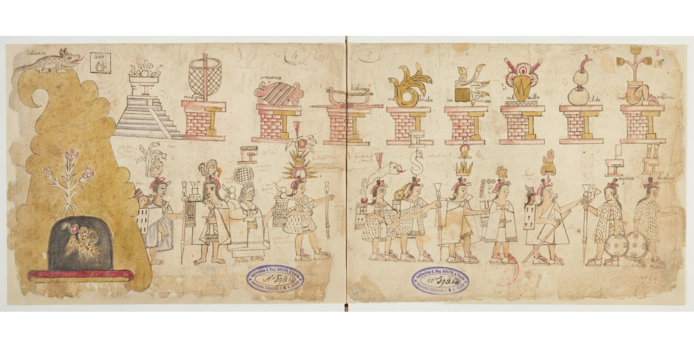

# Welcome to Introduction to Early Latin America

Welcome to a new semester and the opportunity to be your smartest self! Course information is available from the menu links and also here:

1.  [[Course Info/syllabus|syllabus]]
2. [[Course Info/calendar|calendar]]
3.  [[Course Info/assignments|assignments]]

If you're curious, here's a trailer I made for last year's course that gives you an idea of where we're headed. 

<iframe width="650" height="315" src="https://www.youtube.com/embed/BD__KLCCGpo?si=ciCXDngZDAAgHmUa" title="YouTube video player" frameborder="0" allow="accelerometer; autoplay; clipboard-write; encrypted-media; gyroscope; picture-in-picture; web-share" referrerpolicy="strict-origin-when-cross-origin" allowfullscreen></iframe>

